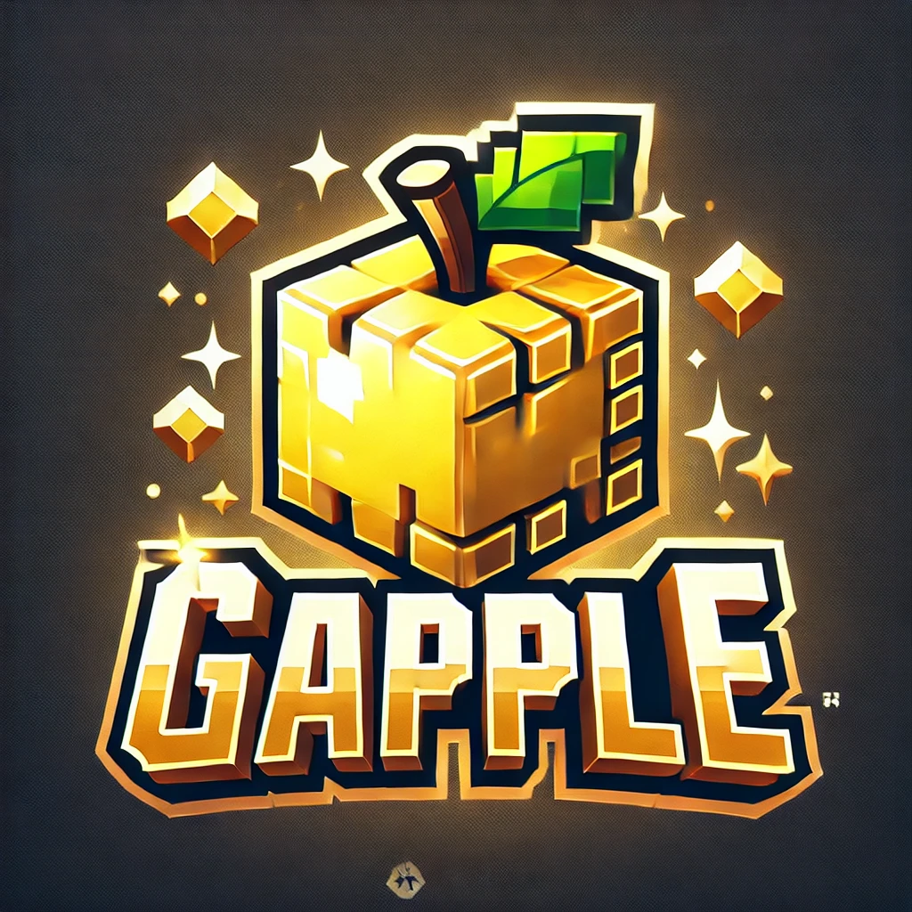

# Gapple

Me and some co-workers were joking about mock companies and came up with "Gapple", which was to to be an Apple-like tech company but with the Minecraft Golden Apple as the logo. This then led to the idea of a website as well for it, and well, I decided to just ChatGPT it out of curiousity.

This was generated all using the 4o variant of the model and the basic chat window without extra features. The quotes are my questions to GPT, I did not save its responses as most of its work was done within the website itself.

## License

This is MIT licensed. Really, this is public domain as it's AI created and the only thing I did was ask a few questions, the brunt of the work will be the Internet that the AI is trained on with the countless creators who have had their data scraped, and of course the model creators themselves at OpenAI and the countless researchers they have used the work of without the compensations they should be due.

If you for some reason want to use this? Go for it. There are better templates out there and better ideas I'm sure, but it was a neat investigation into what 4o could do with some pretty simple prompts.

## Initial Idea
> Create an image of a company logo for the company Gapple, which has the minecraft golden apple on it

## Initial iteration
> Ok, can you make me a website that looks like every other tech company's website? It should use that JS library to make those dots that interact with your mouse, but they should be golden

[gapple.html](./gapple.html)

## Iterative changes
> This is wonderful. Now, can you add a set of cards that would hold products as well as a menu bar up top. It should mirror the style of most tech startups. If you can also make the font pixely like in minecraft, that'd also be great

> Ok, this is good, but the cards aren't being rendered. Can you also add something to the background so it isn't just black? Maybe some sort of animated gradient? Or if you're feeling up for the challenge, something abstract with geometric lines. Maybe in 3D with cubes that are in the style of minecraft

> Can you try again? I don't see any edits

> Can you keep the cubes, but also add back the golden particles that follow the mouse?

> Can you also make the links in the navbar go to the different sections of the page?
> 
> e.g. there should be a Products section, and then an about section with text about the company. You can make something up about Change the world, one cube at a time with golden apples as our power source. And then contact, which should have an address and form fill box to send a message.

> Almost, the background starts rending after the contact section, but it should stay static for the entire site as you scroll. Adding a little bit of scroll paralax would be smart however.

> Can you add back the mouse particles? They should be the same as they were in the first iteration. Make sure the cubes stay.

At this point, I took over and fixed up a few things, added transparency to the sections so that the background was correct, and copied over the v1 mouse particles logic since it was better. This is where V2 comes from

[gapplev2.html](gapplev2.html)
